# Installation

## Install Simplicity Studio

[Download](https://www.silabs.com/developers/simplicity-studio) the latest version of Simplicity Studio and follow the [installation instructions](https://docs.silabs.com/simplicity-studio-5-users-guide/latest/ss-5-users-guide-getting-started/install-ss-5-and-software). During the installation:

   - make sure you log in to Simplicity Studio in the **Installation Manager** window,
   - select **Install by technology type**, and
   - select the **WiSeConnect** extension under **32-bit and Wireless MCUs**.

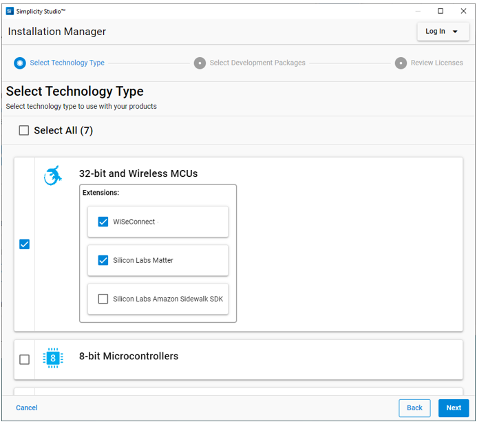

## Install the GNU ARM v12.2.1 Toolchain

> **Note:** From **v4.4.0** on, **Gecko SDK (GSDK)** requires **v12.2.1** of the **GNU ARM toolchain** to compile a project successfully. Follow the instructions in this section to install this toolchain version and configure it for your new projects.

1. Log in to Simplicity Studio if not already done.
2. In the Simplicity Studio home page, select **Install > Manage installed packages**.

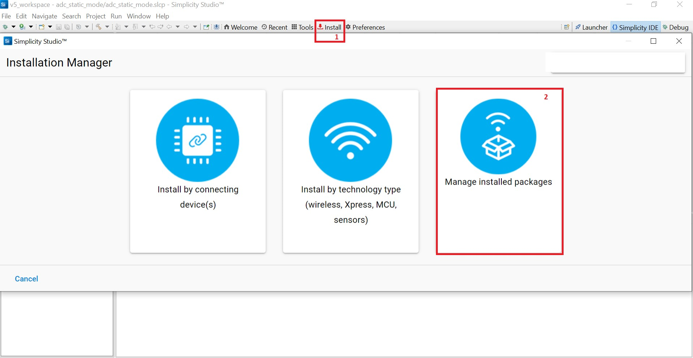

3. Select the **Toolchains** tab.
4. Click **Install** next to **GNU ARM Toolchain (v12.2.rel1.xxxx.x) - 12.2.yyyy**, where **xxxx.x** and **yyyy** may vary depending on the toolchain minor or patch version.

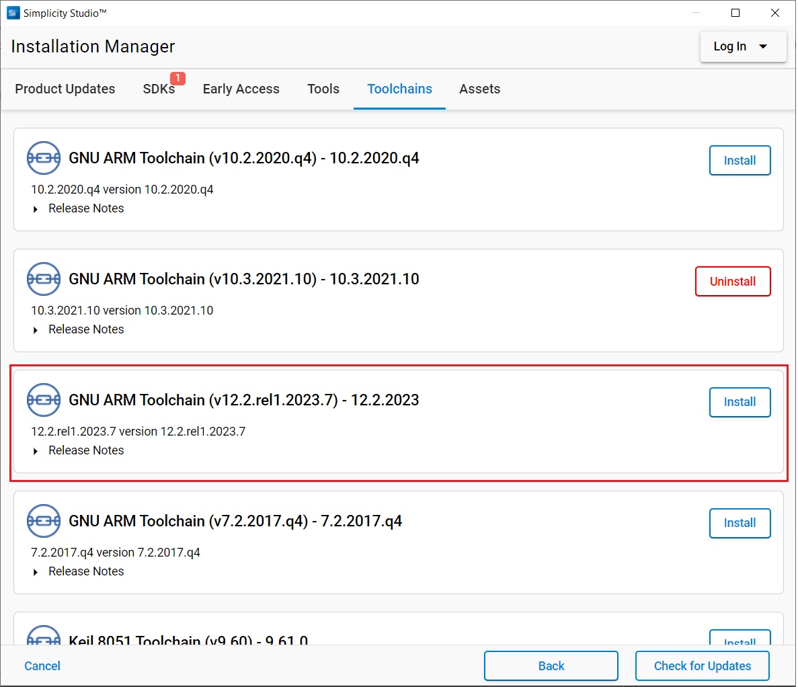

5. The toolchain will be installed.
6. Close the **Installation Manager** window.
7. Click **Preferences**.
8. Expand the **Simplicity Studio** section in the **Preferences** dialog and select the **Toolchains** section.
9. Select **GNU ARM v12.2.1** and un-select all other toolchains shown.
10. Click **Apply and Close**.

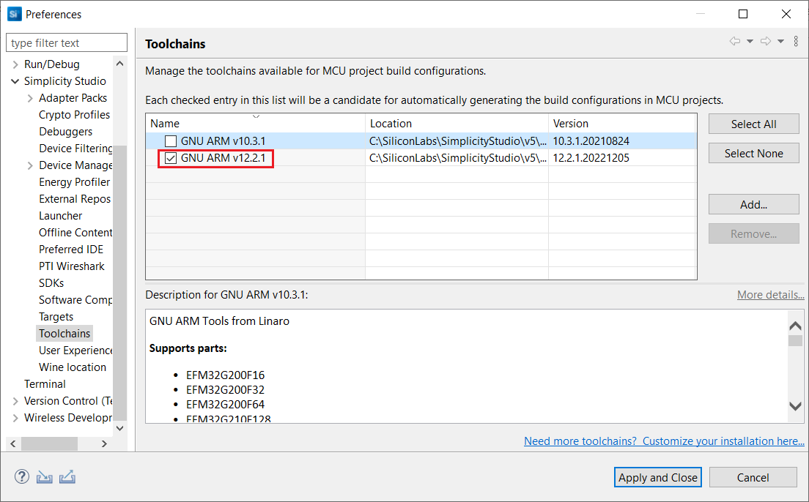

> **Note:** If you have an existing project, see [Silicon Labs community page](https://community.silabs.com/s/article/Notes-on-Simplicity-Studio-SV5-8-0-0-and-Gecko-SDK-4-4-0-0-release?language=en_US) for instructions to configure the toolchain version in your project.

## Upgrade SiWx91x Connectivity Firmware

We recommend that you upgrade the SiWx917 connectivity firmware to the latest available version when:

- you first receive an SiWx917 Pro kit
- you first receive a radio board, or
- you upgrade to a new version of the WiSeConnect 3 extension

1. In the **Simplicity Studio** home page, click **Tools**.
2. In the **Tools** dialog, select **Simplicity Commander** and click **OK**.

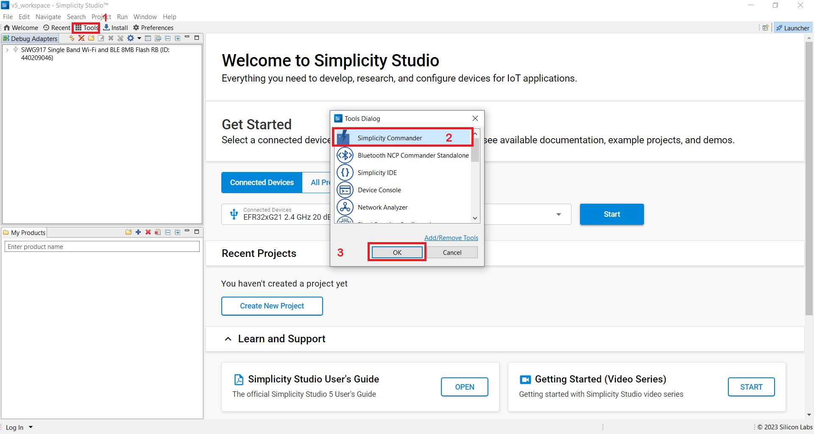

3. In the **Simplicity Commander** window, click **Select Kit** and choose your radio board.

4. In the navigation pane, go to the **Flash** section.
5. Click **Browse** next to the **Binary File** field.

6. Locate and select the firmware file to flash from within the `connectivity_firmware` sub-folder of the **WiSeConnect 3** extension path.

> **Note:** To find out the path of the WiSeConnect 3 extension, click **Window > Preferences > SDKs** in the main window and look for the **WiSeConnect 3** extension path under the **Gecko SDK**.
>
> 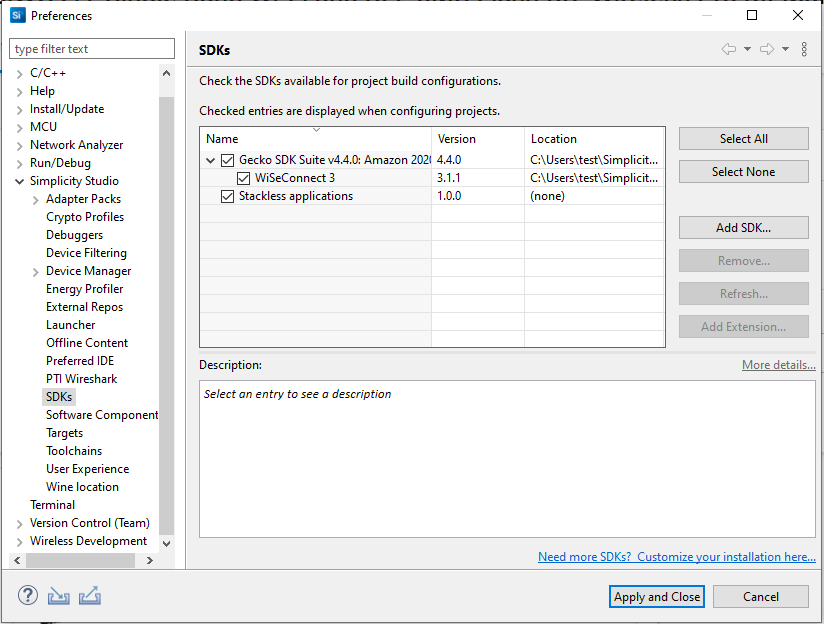

7. Click **Flash**.

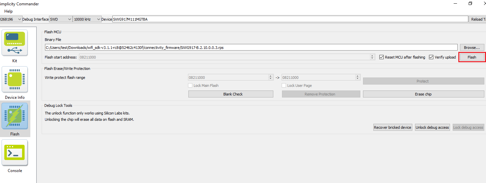

8. The firmware will be flashed and the **Log Window** should display the message: `Flashing completed successfully!`

# Create Project

1. Log in to Simplicity Studio and connect the SiWx91x to your computer.
2. Go to the **Debug Adapters** section.
3. Select your radio board from the displayed list.
4. The **Launcher** page will display the selected radio board's details.
5. Select the **OVERVIEW** tab.
6. Verify the following in the **General Information** section:
    - The **Debug Mode** is **Onboard Device (MCU)**.
    - The **Preferred SDK** is the version you selected earlier.

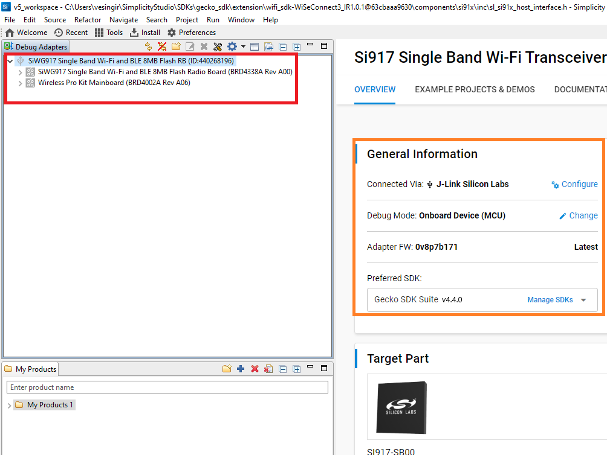

7. Select the **EXAMPLE PROJECTS AND DEMOS** tab.
8. Locate the example you want and click **CREATE**.

> **Note:** We recommend using the **Wi-Fi - STATION PING (SOC)** example with this guide.

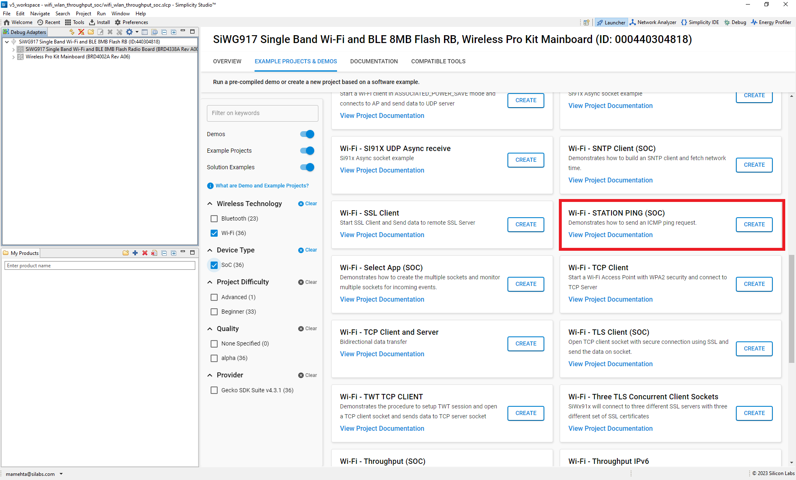

9. In the **New Project Wizard** window, click **FINISH**.

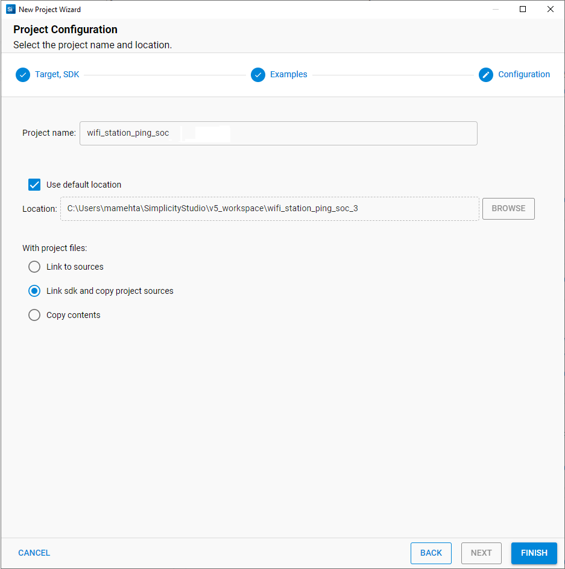

# Configure an Application

Configure the settings for your example. For **Wi-Fi - STATION PING (SOC)** (the recommended example for this guide) or for other examples, see the [Application Build Environment](https://github.com/SiliconLabs/wiseconnect/tree/master/examples/snippets/wlan/station_ping#application-build-environment) section in the **README** page for configuration instructions.

You may use the [Component Editor](https://docs.silabs.com/simplicity-studio-5-users-guide/latest/ss-5-users-guide-developing-with-project-configurator/component-editor) to configure the components in your example.

# Build an Application

In the **Project Explorer** pane, right-click the project name and select **Build Project**.

You may also click the **Build** button with a hammer icon on the Simplicity IDE perspective toolbar.

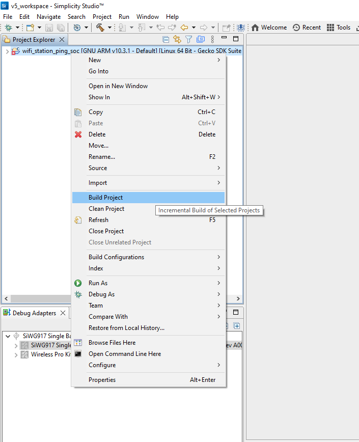

# Flash an Application

1. Build the application as described in the [Build an Application](#build-an-application) section.
2. In the **Project Explorer** pane, right-click the project name and select **Run As > 1 Silicon Labs ARM Program**.

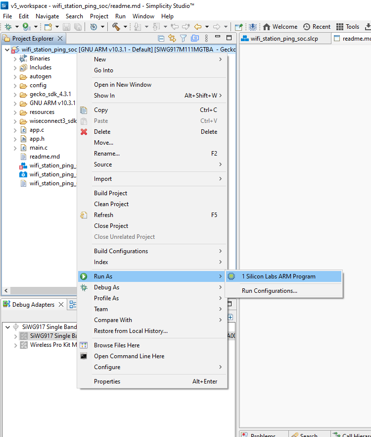

3. The application binary will be flashed on the radio board and the application will start running.

# Debug an Application

1. In the **Project Explorer** pane, select your project name.
2. From the menu, select **Run > Debug As > 1 Silicon Labs ARM Program**.

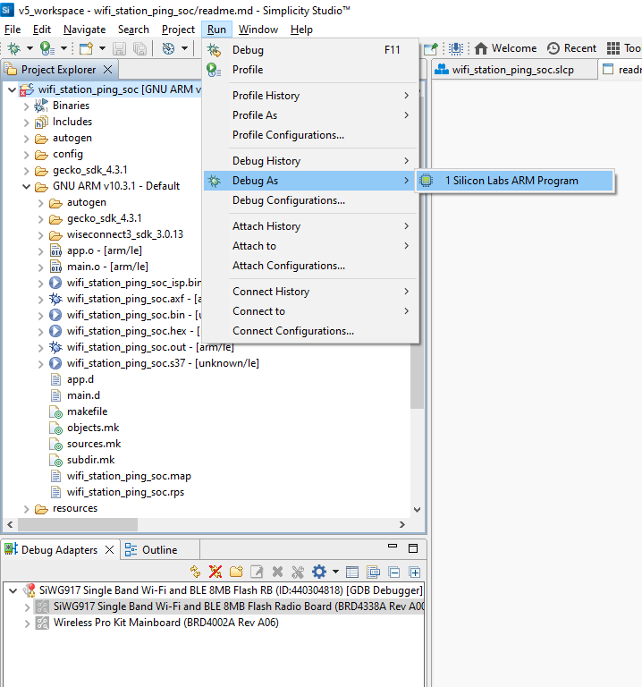

3. Studio will switch to debug mode and halt execution at the `main()` function in your application.
4. Add a break point in the desired location of the code and click the **Resume** button (having an icon with a rectangular bar and play button).
5. Execution should halt at the break point.
6. The rest of the debug functions are also as usual.

# Console Input and Output

1. In the **Debug Adapters** pane, select your WPK board.
2. The **Adapter FW** field shows your WPK board's current firmware version, similar to 1v**n**p**xx**b***yyy***, where **n** is the major version, **xx** is the patch version number and **yyy** is the build number.
3. Click **Update to 1.4.xx.yyyy** if the version is before **1v4p10b215**, or in other words:
   - Major version = 4 and one of the following is true:
     - patch < 10 or
     - patch = 10 and build < 215

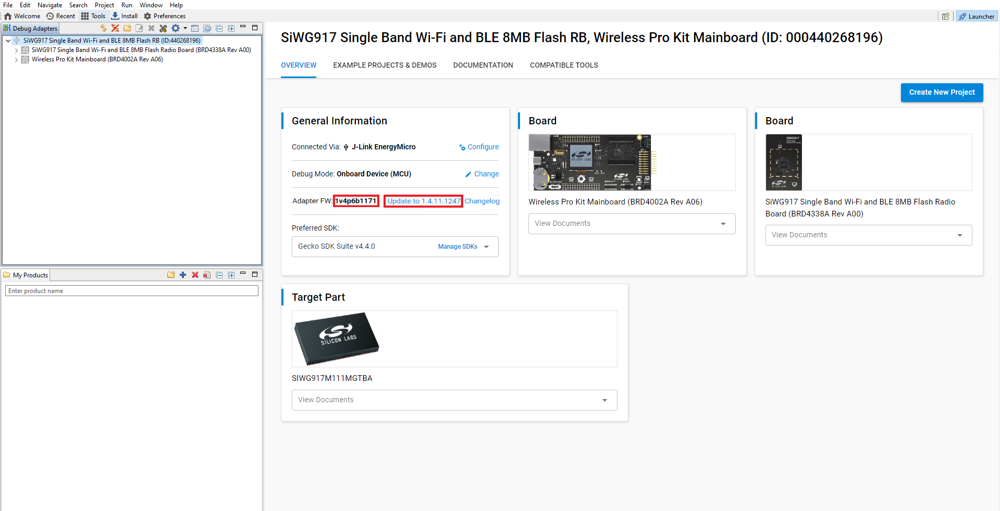

4. The firmware will be upgraded on your WPK board.
5. In the **Debug Adapters** pane, right-click on your radio board and click **Launch Console**.

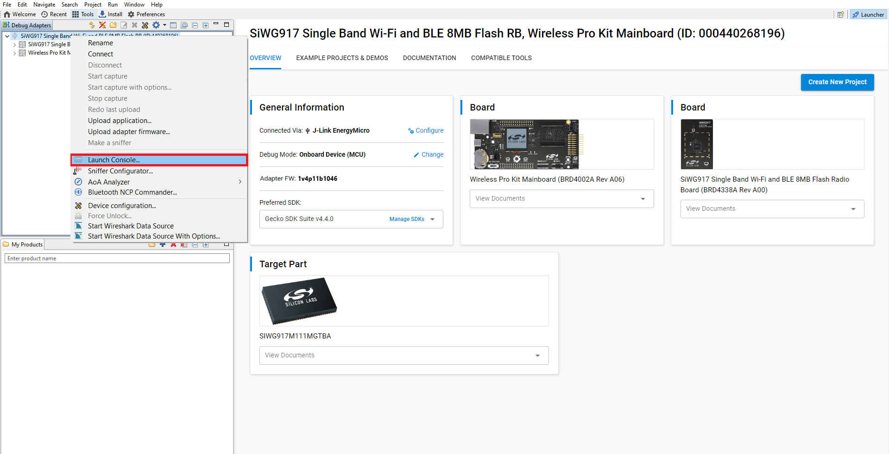

6. Select the **Serial 1** tab.
7. Place the cursor inside the text input field and hit **Enter**.
8. Console output will start getting displayed in the **Serial 1** tab.

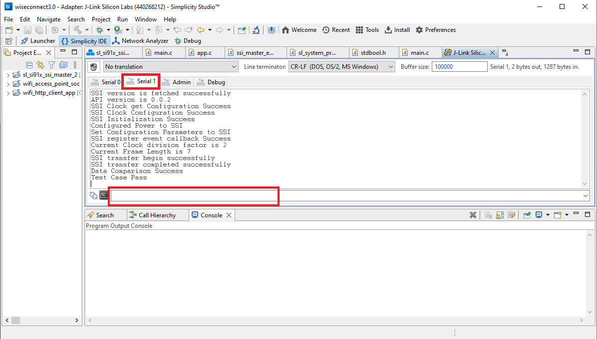

9. Console input can be entered and sent to the device.

# Customize Application Components

Simplicity Studio allows you to add or remove functional components in your application, such as BSD Sockets.

> **Note:** For information about the functional components available with WiSeConnect SDK v3.x, see the [Application Components](https://docs.silabs.com/wiseconnect/latest/wiseconnect-developers-guide-migr-sdk-changes/application-components) section.

## Add a Component

1. In the **Project Explorer** pane, double-click the `project_name.slcp` file.
2. Select the **SOFTWARE COMPONENTS** tab.
3. Select the **SDK Extensions** filter.
4. Browse or search for and select the component that you want to install.
5. Click **Install**.

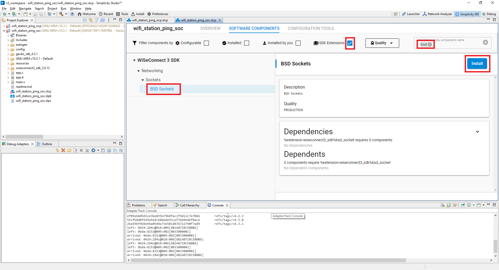

6. Studio should add the component and display a success message.

> **Note:** You may use the [Component Editor](https://docs.silabs.com/simplicity-studio-5-users-guide/latest/ss-5-users-guide-developing-with-project-configurator/component-editor) to configure a component after adding it or to configure other components in your example.

## Remove a Component

1. Select the **Installed** filter to view the components you have installed.
2. Browse or search for and select the component you want to remove.
3. Select the component and click **Uninstall**.

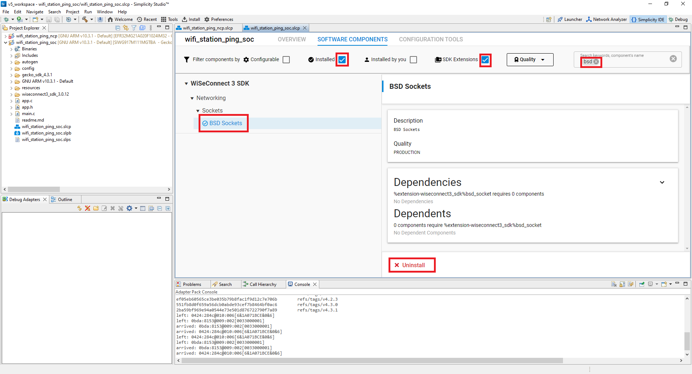
